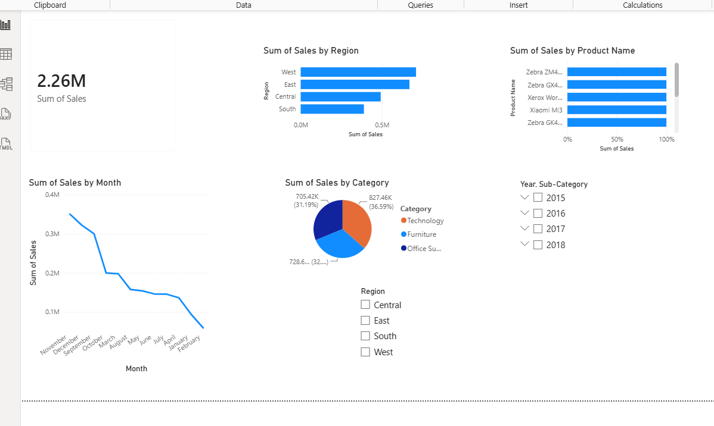

# Sales Analytics Dashboard

## Project Overview
This project analyzes sales data using Python, Pandas, and Power BI.

## Tools Used
- Python
- Pandas
- Power BI
- CSV Dataset

## Features
- Total Sales Analysis
- Sales by Region
- Category-wise Sales
- Top 10 Products
- Interactive Dashboard Filters

## Project Structure

Sales-Analytics-Dashboard/
├── sales_analysis.py
├── clean_sales_data.csv
├── SalesDashboard.pbix
├── README.md
└── screenshots/

## How to Run

1. Install Pandas

```bash
pip install pandas
```

2. Run Python Script

```bash
python sales_analysis.py
```

3. Open Power BI Desktop
4. Import clean_sales_data.csv
5. Create dashboard visuals

## Dashboard Preview



## Author

Meghana
